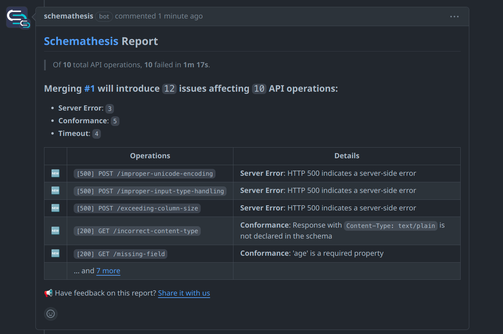

We have finally reached the end of this magnificent journey, so you should now
have some idea of what a REST API is, understand some of the benefits of using
an OpenAPI contract file that can be read by both humans and machines, and
have a high-level grasp of how fuzzing can be applied to automatically test
services exposing an API.

Automated fuzzing, especially in this particular context of REST APIs, is at the
heart of automated testing, which is essential to allow for effective Continuous
Integration without compromising robustness. An API testing tool such as
Schemathesis can be implemented as a key component in a testing pipeline to
complement human-written and human-driven tests to ensure all stakeholders have
confidence in the system's continuous reliability.

We find that Schemathesis in specific works well and comes with several
benefits, including seamless integration with GitHub Actions:

\
_(Image source: Schemathesis)_

Nevertheless, there are many other tools with similar features, each counting
with their own pros and cons, specializing in different areas of fuzzing, and
with more or less knobs to customize how they work. The important point we want
to stress in this tutorial is not what specific fuzzer you should choose, but
that there are significant advantages to using API fuzzing in general as part of
your automated testing pipeline. It's a topic highly relevant to DevOps and
very much worth having an overview of, which is what this tutorial attempts to
accomplish.

Thanks for sticking with us, and remember to live a happy life.
