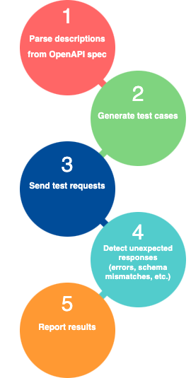

# Intro to Fuzzing

If this is your first time hearing about the term **fuzzing**, you might think
it's somehow related to your imaginary cat Mathilda's fuzzy fur. Somewhat
surprisingly though, that is not the case in this context: Mathilda was a mere
pedagogical device, living in a hypothetical world, and she will cease existing
as soon as we stop thinking about her (i.e., now).

Instead, fuzzing (also known as fuzz testing) is a software testing technique
that automates generating random inputs (within some constraints) and running
the target program using those inputs to analyze its behavior. For instance, one
can verify that the output matches certain expectations and that certain errors
are thrown under certain conditions (instead of crashing the program or
returning an invalid result).

For example, a fuzzer might execute a calendar program's "add new event" feature
hundreds of times with many different dates, just to see how it behaves. It can
try submitting a wide range of real dates across several months and years, but
importantly it can also try injecting what it knows to be malformed data, such
as 30th of February 2024. These inputs are generated by complex algorithms that
use a combination of pseudo-random data and fuzzing vectors which are known to
be dangerous.

Testers can then use the information gathered from this kind of testing to
identify problems with their code, including security vulnerabilities. Knowing
that certain inputs cause unexpected behavior in their programs, developers can
easily use debugging tools to understand and fix the problems detected by
fuzzing.

However, it is important to note that the main purpose of fuzzing is to
highlight the *presence* of bugs, rather than their *absence*: it is still very
much possible for software to have problems even if they are not identified
using fuzzing, since it inherently tests a pseudo-random sample of use cases but
does not sweep the entire input space.

# Schemathesis

To showcase the practical applications of fuzzers, we'll look at one concrete
example tool: **Schemathesis**. This program, written in Python and used by
industry leaders like Netflix and IBM, cleverly makes use of OpenAPI
specification files to automatically infer how and where it should test servers
that expose an HTTP REST API, just like the Calculator we have been working
with.



Schemathesis reads the OpenAPI document (also known as the _contract_) and just
based on the information it provides it can determine what API endpoints are
available (and where), as well as what valid inputs look like and what aspect it
should expect from server responses. Based on the typing indicated in the
schemas, it can intelligently come up with appropriate inputs that are likely
to yield more interesting results, such as trying to send enormous integers
when a number is expected to see if the server overflows and crashes.

Importantly, since everything relevant about the API is already conveyed in the
contract document, we don't need to tell Schemathesis almost anything when we
execute it, which means it's really easy to use. But don't take our word for it,
try running it yourself against the Calculator API!

Just run the following command in your terminal on the right:

```sh
st run --checks all openapi.yaml --base-url http://localhost:3025 > st.out
```

This will perform all relevant checks against our Calculator, based on the
contract we've already looked at and assuming the server is running on port
`3025`, and save the result to `st.out`{{}}, which we'll analyze in the next
step.

You can see that it was quite fast, and yet the fuzzer generated hundreds of
inputs which were independently tested.

# Next Up

Now that we've ran the command and seen how easy it was, we should look closer
at what problems Schemathesis is actually reporting for our application.
